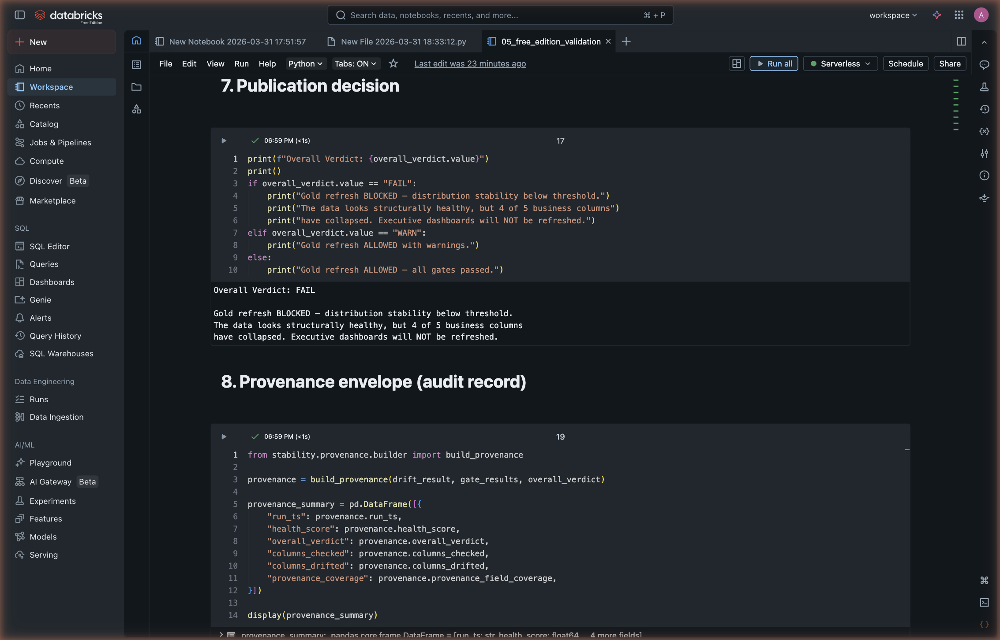
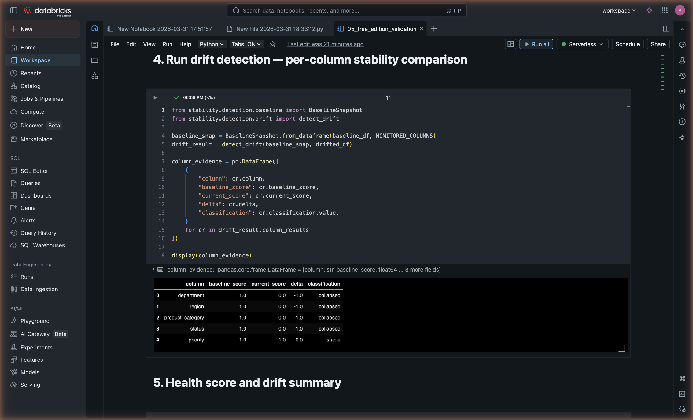
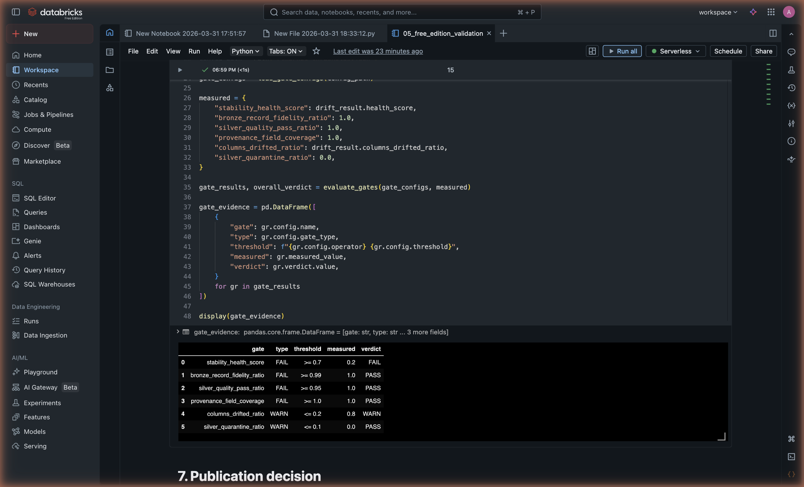
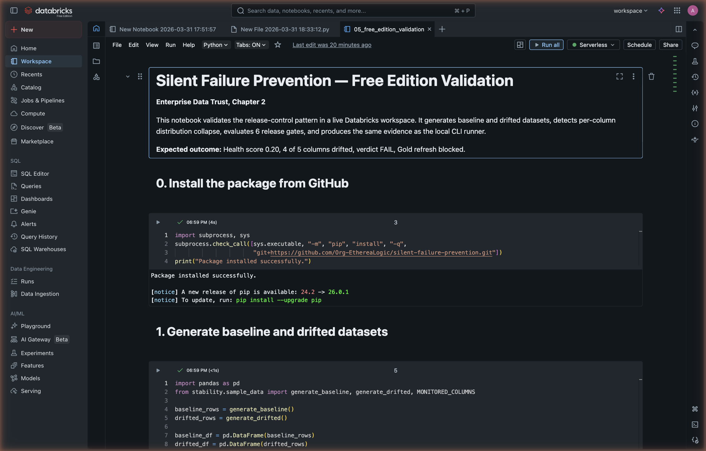
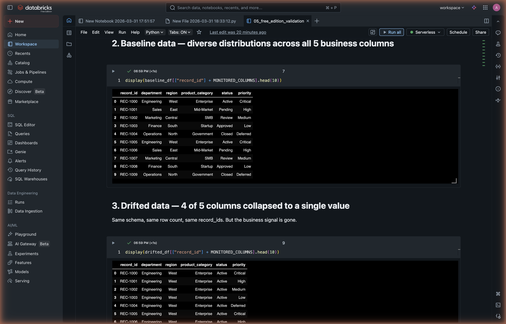
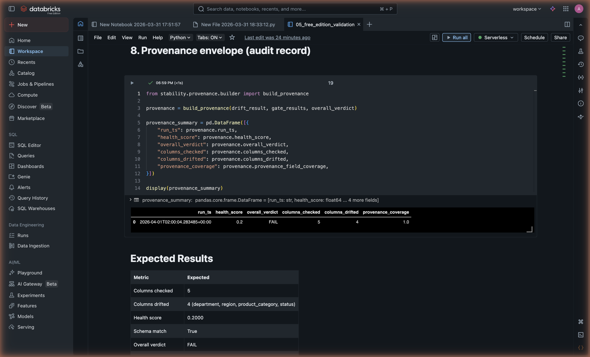

# Before Corrupted Numbers Reach the Board, Block the Refresh

**Enterprise Data Trust — Chapter 2: Silent Failure Prevention**

Built by Anthony Johnson | EthereaLogic LLC

---

The most expensive data failures are the ones nobody catches. A source system defaults a business field to a single value. A category mix collapses after an upstream migration. Row counts reconcile. Jobs complete on schedule. Dashboards refresh. And the CFO presents numbers to the board that no longer reflect reality.

This chapter demonstrates a release control that detects when business columns collapse despite healthy schema and row counts — and blocks Gold publication before corrupted numbers reach executive dashboards.

Standard pipeline monitoring catches structural failures. It does not catch silent signal collapse — where data retains its shape while the business meaning degrades. That gap is what this chapter closes.

## Executive Summary

| Leadership question | Answer |
| ------------------- | ------ |
| What business risk does this address? | Business columns collapse to a single value after an upstream change. Schema and row counts look healthy. Dashboards refresh with numbers that no longer reflect reality. |
| What does this chapter prove? | A release-control pattern that measures distribution stability across monitored columns, evaluates six configurable gates, and blocks Gold publication when the health score drops. |
| Why does it matter? | Executive dashboards are the highest-trust surface in the data platform. This pattern prevents corrupted numbers from reaching them by blocking the refresh before it happens. |

## Key Exhibits

### Exhibit 1: Gold Refresh Blocked

The release control detected distribution collapse across four of five monitored business columns and blocked Gold publication. This is the control doing its job — preventing corrupted numbers from reaching executive dashboards.

<p align="center">
  
</p>

### Exhibit 2: Per-Column Drift Detection

Each monitored column is scored individually against the trusted baseline. Four of five columns collapsed from diverse distributions to single values — producing a table health score of 0.20 against a threshold of 0.70.

<p align="center">
  
</p>

### Exhibit 3: Six-Gate Evaluation

Six configurable release gates evaluate whether Gold publication is allowed, warned, or blocked. Each gate emits a verdict with the measured value recorded alongside the threshold.

<p align="center">
  
</p>

## The Business Problem

Traditional pipeline monitoring catches structural failures but leaves a dangerous blind spot:

- **Distribution collapse is invisible to schema checks.** A column that held five distinct region codes yesterday now holds one. The schema is intact. The row count matches. The dashboard updates. The numbers are wrong.
- **Signal degradation compounds silently.** When a source system defaults a business field after a migration, the first refresh looks normal. By the time someone notices, weeks of reports are corrupted.
- **Publication has no quality gate.** Most pipelines publish to Gold on a schedule. There is no check between "transformation completed" and "executive dashboard refreshed" that validates whether the business signal survived.

These are not hypothetical risks. They are the failure class that produces board-level data incidents.

## What This Repository Proves

| Verified outcome | Evidence from this repository |
| ---------------- | ----------------------------- |
| Distribution collapse is detected before publication | 4 of 5 monitored columns collapsed; health score dropped to 0.20 |
| Publication is blocked when signal degrades | Gold refresh BLOCKED when health score fell below 0.70 threshold |
| Gate evaluation is configurable and auditable | 6 gates with explicit thresholds, measured values, and PASS/WARN/FAIL verdicts |
| Audit envelope is built automatically | Provenance record with timestamps, per-column evidence, and gate outcomes |

## Decision / KPI Contract

**Business decision:** should the current data load be published to executive dashboards?

| KPI | Meaning |
| --- | ------- |
| `health_score` | Aggregate distribution stability across monitored columns (0.0–1.0) |
| `columns_drifted` | Count of columns whose distribution has shifted beyond threshold |
| `columns_drifted_ratio` | Proportion of monitored columns exhibiting drift |
| `overall_verdict` | PASS / WARN / FAIL based on 6 configurable gates |
| `provenance_field_coverage` | Completeness of the audit envelope (1.0 = all fields populated) |

**Control rule:** Gold publication is blocked when `health_score` falls below `0.70`. The stability gate is the decisive check — all other gates provide supporting evidence.

## Why This Pattern

- **Gap 1.** Distribution stability must be measured, not assumed. A column that collapses from five distinct values to one scores 0.0 regardless of whether the schema and row count are intact.
- **Gap 2.** Publication gates must be configurable and auditable. Six gates with explicit thresholds are evaluated on every run. Each gate emits a verdict with the measured value recorded alongside the threshold.
- **Gap 3.** The audit envelope must be built automatically. Every run produces a provenance record with timestamps, per-column evidence, gate outcomes, and the overall verdict — ready for governance review without manual assembly.

## How It Works

1. **Baseline capture.** A trusted baseline is captured across the monitored business columns using normalized Shannon entropy.
2. **Distribution measurement.** Each new data load is measured against that baseline to determine whether distribution stability has been maintained.
3. **Health scoring.** Per-column results are aggregated into a table health score (0.0–1.0).
4. **Gate evaluation.** Six configurable release gates evaluate whether Gold publication is allowed, warned, or blocked.
5. **Provenance envelope.** A provenance record captures the run context, verdict, and drift evidence for auditability.

Technical details, formulas, and gate definitions are in [docs/technical-approach.md](docs/technical-approach.md).

## Databricks Fit

- **Distribution stability scoring** maps to the Silver-to-Gold boundary in a Medallion Architecture.
- **Publication gates** block Gold refresh before corrupted data reaches executive dashboards.
- **Provenance envelopes** provide governance and audit documentation for Unity Catalog lineage.
- **Serverless compute** in Databricks Free Edition validated the full release-control pattern.
- The pattern is column-agnostic and applies to any monitored table regardless of source system.

## Portfolio Install Order

Install Chapter One first. `trusted-source-intake` is the canonical home of the
portfolio launcher:

- `Open Executive Demo.command`
- `scripts/executive_mode.py`
- `docs/executive_mode.md`

For the launcher to discover this chapter automatically, clone
`silent-failure-prevention` into the same parent directory as
`trusted-source-intake`.

## Reproducibility

Use Python 3.10 or newer.

```bash
git clone https://github.com/Org-EthereaLogic/silent-failure-prevention.git
cd silent-failure-prevention

python3 -m venv .venv && source .venv/bin/activate
python -m pip install --upgrade pip setuptools wheel
pip install -e ".[dev]"
pytest -q        # Expected: 50 passed
stability-demo   # Expected: Health 0.20, FAIL
```

## Evidence Appendix

| Evidence item | What it shows |
| ------------- | ------------- |
|  | Validation notebook loaded in Databricks Free Edition workspace |
|  | Baseline (diverse) vs drifted (collapsed) datasets generated |
|  | Audit-ready provenance record with full field coverage |

## Scope Boundary

This validates the release-control pattern using deterministic sample data in a Databricks Free Edition workspace. It does not constitute production deployment, multi-source verification, or live Databricks production execution. The demonstration models a five-column business table designed to trigger distribution collapse.

## Engineering Signals

- GitHub Actions workflow: [ci.yml](https://github.com/Org-EthereaLogic/silent-failure-prevention/actions/workflows/ci.yml)

## Additional Documentation

- [Technical approach and gate definitions](docs/technical-approach.md)

## Part of a Series

This is **Chapter 2** of the *Enterprise Data Trust* portfolio — a three-part body of work addressing the full lifecycle of data reliability in enterprise Databricks platforms.

Install Chapter One first if you want the guided portfolio launcher. This
chapter is designed to run as a sibling repository beside `trusted-source-intake`.

| Chapter | Focus | Repository |
| ------- | ----- | ---------- |
| 1. Trusted Source Intake | Validate and certify data before downstream consumption | [trusted-source-intake](https://github.com/Org-EthereaLogic/trusted-source-intake) |
| **2. Silent Failure Prevention** | Detect distribution drift before it reaches executive dashboards | ← You are here |
| 3. Measurable Control Effectiveness | Prove that data controls hold against known failure scenarios | [measurable-control-effectiveness](https://github.com/Org-EthereaLogic/measurable-control-effectiveness) |

MIT License. See [LICENSE.md](LICENSE.md) for details.
